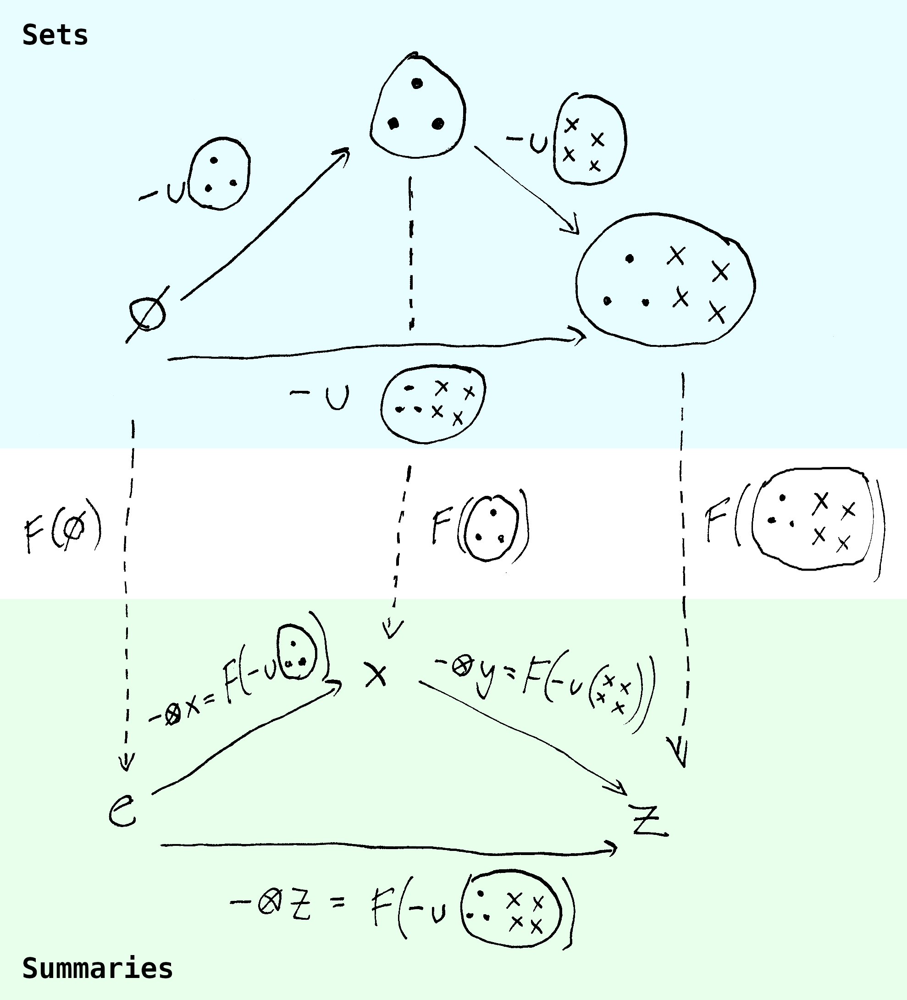

## Big thanks...

:::{.columns}
:::{.column}
{fig-align="left"}
:::

:::{.column}
{fig-align="left"}
:::
:::

- The University of Auckland Department of Statistics
- Dr. Filip Krikava (CTU), Antony Unwin, the statistical graphics and R community
- My partner Nela, family, friends

## Topic evolution

- Master's thesis: implement a portable interactive data visualization library in JS for R, building on `iplots` [@urbanek2003; @urbanek2011]
- Wanted to incorporate Grammar of Graphics [GoG, @wilkinson2012]
- Also had interest in functional programming at the time
  - Realized there are parallel concerns
- This eventually lead me to category theory [@fong2019]

## The motivating problem... {.center-title}

## Split in interactive graphics

-   **"Classical" IDV systems (~1980-2010s)**
    - Standalone apps
    - Deep interactivity (linked selection, parametric interaction, tours,...) 
    - Less flexible, nominal style: *scatterplot, barplot, ...*
-   **Modern web-based IDV systems (2005-current)** 
    - Focus on dashboards, presentation
    - Highly customizable but less interactivity out-of-the-box
    - Compositional style: *plot with point geometry and continuous x- and y- encodings...* 
    
## *Why is it so hard to combine flexibility with deep interactive features?* {.center-title}

## The Grammar of Graphics and independence

- Plots composed out of modular components [@wilkinson2012]:
  - Data, aesthetics, stats, geoms, scales, coordinate systems
- Components treated as (semi-)independent
  - "Lego bricks", mix-and-match
  - Particularly in software implementations [e.g. `ggplo2`, @wickham2016; `altair` @vanderplas2018, etc...]
- *Powerful, however, are there limits? Particularly when it comes to interactivity?*

## Limits of independence

:::{.incremental}
- *"This system cannot produce a meaningless graphic, however. This is a strong claim, vulnerable to a single counter-example. It is a claim based on the formal rules of the system, however, not on the evaluation of specific graphics it may produce."* [@wilkinson2012, pp. 15]

- *"Some of the combinations of graphs and statistical methods may be degenerate or bizarre, but there is no moral reason to restrict them."* [@wilkinson2012, pp. 112]

:::

## Let's start from some definitions... {.center-title}

## Plots as maps (functions)

- A plot is a map from data to a graphical display (computer screen/paper):

$$\text{Data} \to \text{Graphics}$$

- *Can this map be arbitrary? No*
  - Draw a single red square regardless of data - valid function but bad plot
  - Plots can be misleading representations [@tufte2001; @cairo2014]
  - Faithful plots "in the wild" exhibit many regular features
  - Interactivity adds additional constraints

## Regular plots

- Useful definition (?): think about geoms as sets, plots as *partitions*:
    -   A surjective collection of disjoint subsets
    -   *= Each point, bar, or line represents a distinct set of cases/rows, and together the objects cover the whole data space (bijection)*

::: {style="margin-top: -30px; margin-bottom: -30px;"}
$$\text{Data subsets} \to \text{Geometric objects}$$
:::
    
-   Some exceptions:
    -   2D KDE plots (multiple isopleths map to the same datapoints)
    -   Graphical deficiencies (e.g. overplotting)
- However, covers vast majority of classic plots

## Plots as partitions and interactivity

- The (bijective) partition model is well-suited for interactive graphics
- Provides clear visual mapping in linked selection:
  - *If I click a bar in a plot, only that bar gets highlighted* <br> (not the case with non-disjoint data subsets)
  
```{r}
#| echo: false
#| fig-width: 30
#| fig-align: "center"
library(ggplot2)
library(patchwork)

theme_set(
  theme_bw() + theme(
    panel.grid = element_blank(),
    axis.text = element_blank(),
    axis.title.x = element_blank(),
    axis.title.y = element_blank(),
    axis.ticks = element_blank(),
    panel.border = element_blank()
  ))

mtcars$am <- factor(mtcars$am)

p1 <- ggplot(mtcars, aes(cyl, mpg)) +
  geom_bar(stat = "summary", fun = "sum", fill = "grey80") +
  geom_bar(data=subset(mtcars, cyl == 4),
           stat = "summary", fun = "sum", fill = "grey80", 
           col="grey20", linetype="dashed", width = 1.8, size=1.5) +
  annotate("segment", x=3.9, y=230, xend=4.1, yend=210, 
           arrow=arrow(type = "closed", length = unit(0.1, "in")),
           lwd=1.5, linejoin="mitre") +
  guides(linetype="none")

p12 <- ggplot(mtcars, aes(cyl, mpg)) +
  geom_bar(stat = "summary", fun = "sum", alpha=0) +
  annotate("text", x = 6, y = 150, label = "vs.", size=14)

p2 <- ggplot(mtcars, aes(cyl, mpg, fill = cyl == 4)) +
  geom_bar(stat = "summary", fun = "sum") +
  scale_fill_manual(values=c("grey80", "steelblue")) +
  guides(fill = "none") 

mtcars$highlight <- mtcars$am == "1" | mtcars$cyl == 4

p3 <- ggplot(mtcars, aes(cyl, mpg, fill = highlight)) +
  geom_bar(stat = "summary", fun = "sum") +
  scale_fill_manual(values=c("grey80", "steelblue")) +
  guides(fill = "none") 

p1 + plot_spacer() + p2 + p12 + p1 + plot_spacer() + p3 + 
  plot_layout(nrow=1, widths = c(1, 0.2, 1, 1, 1, 0.2, 1))
```
  
- Also useful for e.g. querying: geom/subset information is independent

## Plots, summaries, and aesthetics

- We rarely plot raw data: instead, we often summarize/aggregate
- Also encode the summaries into aesthetics (scales/coord. systems)
- Therefore, the full mapping is a *composition* of several maps:

$$\text{Data subsets} \to \text{Summaries} \to \text{Aesthetics} \to \text{Geometric objects}$$

- *The domains/codomains of these maps often have structure which the maps may or may not preserve*

## Example: Stacking 1

- The data partition can have a hierarchical structure
  - = Data subsets made up of smaller subsets
  - E.g. stacked bar made up of segments, pie chart
  - *Not purely visual* - segments represent data information
- The map should preserve this underlying structure
  - I.e. aggregation and encoding also need to align with the hierarchical structure

## Example: Stacking 2

- Suppose: 

::: {style="margin-top: -30px; margin-bottom: -30px;"}
$$\qquad \text{Bar subset} = \text{Gray subset} \cup \text{Blue subset}$$
:::

- We want: 

::: {style="margin-top: -30px; margin-bottom: -30px;"}
$$\qquad \text{Bar} = \text{Stack}(\text{Gray segment}, \text{Blue segment})$$
:::

```{r}
#| echo: false
#| fig-height: 1
#| fig-width: 1.5
#| fig-align: "center"

ggplot(mtcars, aes(cyl, mpg, fill = am)) +
  geom_bar(stat = "summary", fun = "sum") +
  scale_fill_manual(values=c("grey80", "steelblue")) +
  guides(fill = "none") 
```

## Example: Stacking 3

- The mapping should preserve salient visual properties
- E.g. bar height:

::: {style="margin-top: -15px; margin-bottom: -15px; font-size: 90%;"}
$$\text{Height(Plot(Bar subset))} = \text{Height(Stack(Plot(Blue subset), Plot(Red subset)))}$$
:::

- Not always the case:
  - *"Stacking bars that represent counts, sums, or percentages is fine,<br> but a stacked bar chart where bars show average values is generally meaningless." [@wills2011, p. 112]*
  - *Why* is it meaningless? And *when*?  

## Category theory and functors

- Category theory is an area of math concerned with structure and composition [@fong2019]
- Fundamental concept: a *functor*, generalization of structure-preserving maps
- Functors preserve function composition:

$$F(f ; g) = F(f) ; F(g)$$

## Functors and visualization

- In our case, we can think of $f$ and $g$ as union with some fixed set
  - E.g. $f(x) = x \cup A$, and $g(x) = x \cup B$
  - $x$ can be $\varnothing$
- $F$ is the aggregation (and encoding) map. Then:

::: {style="margin-top: -15px; margin-bottom: -15px; font-size: 90%;"}
$$F(f ; g) = F(f) ; F(g)$$
:::

- Translates to:

::: {style="margin-top: -15px; margin-bottom: -15px; font-size: 90%;"}
$$\text{plot}(\text{summarize}(A \cup B)) = \text{plot}(\text{summarize}(A), \text{summarize}(B))$$
:::

##

{fig-align="center"}

## Functors, groups, monoids, and beyond

- Functors let us reason about structure-preserving plots
- Depends on what structure we want to preserve:
  - Set union: *monoids* (set + binary associative operation + empty element)
      - Parallel computing and RDB research [@parent2018; @fegaras2017; @lin2013; @gibbons2018]
  - Set difference: *groups* (monoid + inverse)
- Practical impact on interactive graphics:
  - Monoids for comparing subsets, *single-subset* selection ($A$ vs $A \cup B$)
  - Groups for comparing disjoint sets, *multi-group selection* ($A$ vs $B$)
- Other properties of set operations: monotonicity, commutativity, etc...
  
## Closing thoughts...

- What we can *do* with a plot is determined by what the plot *is*
- Plot components are not independent, but have (hierarchical) dependencies
- Can be formally described using category theory ("missing link") 
- Most novel contribution, many interesting applied problems as well:
  - Features: interactive and otherwise
  - Data visualization pipeline: reactivity, paritioning, summaries, scales, etc... 
  - Architecture and programming paradigms  

## References
